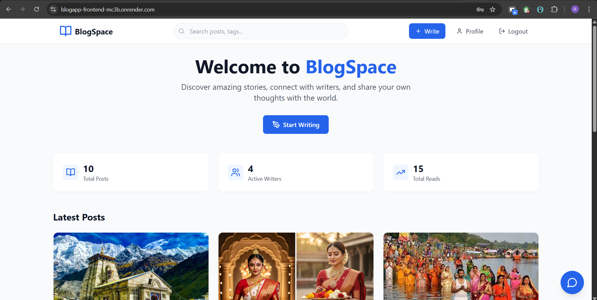
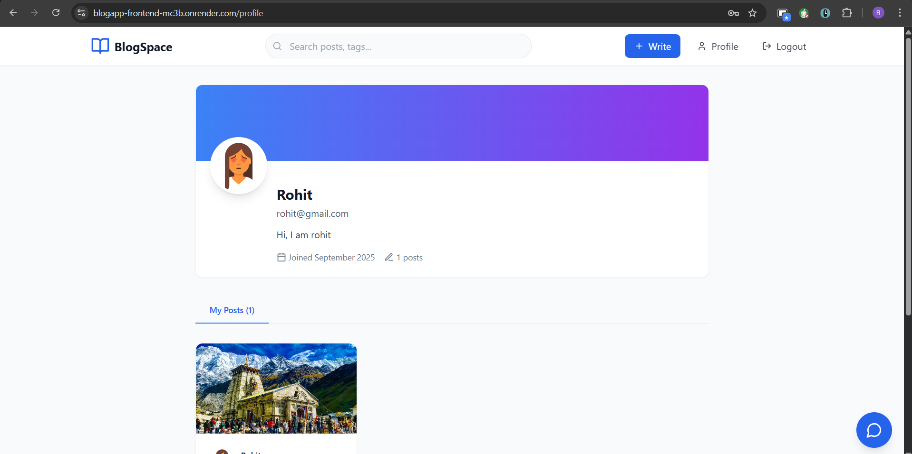
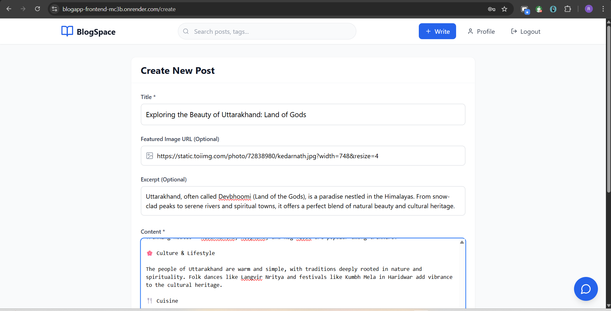
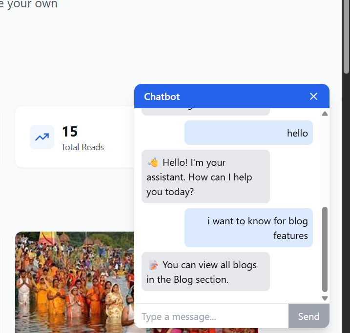
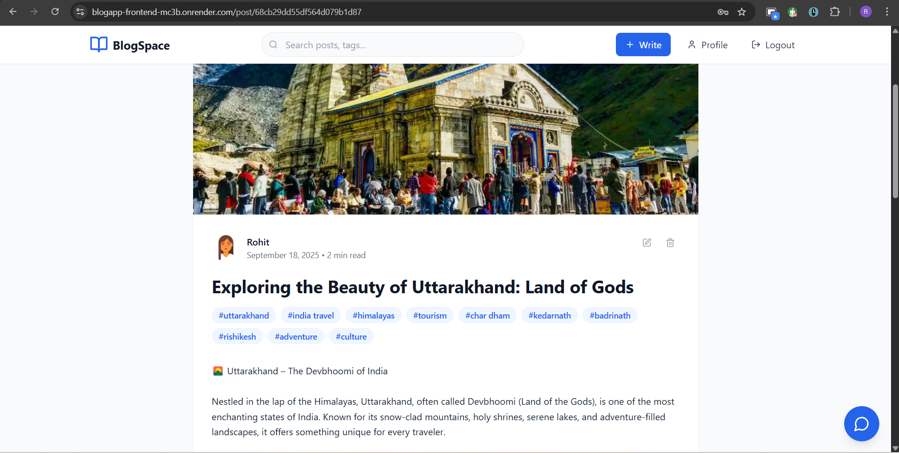

<div align="center">
  
  <h1>BlogSpace ✍️</h1>
  <p><i>A modern full-stack blogging platform built with the MERN stack</i></p>

  []()
  []()
  []()
  []()
  [](LICENSE)
</div>

---

## 🚀 Live Demo

- **Frontend:** [BlogSpace Frontend](https://blogapp-frontend-mc3b.onrender.com)  
- **Backend API:** [BlogSpace API](https://blogapp-mzev.onrender.com)

---

## 📑 Table of Contents
- [✨ Features](#-features)
- [🛠️ Tech Stack](#%EF%B8%8F-tech-stack)
- [📸 Screenshots](#-screenshots)
- [⚡ Quick Start](#-quick-start)
- [⚙️ Environment Variables](#%EF%B8%8F-environment-variables)
- [📡 API Reference](#-api-reference)
- [☁️ Deployment](#%EF%B8%8F-deployment)
- [🐞 Troubleshooting](#-troubleshooting)
- [🤝 Contributing](#-contributing)
- [📜 License](#-license)

---

## ✨ Features

✅ User Authentication (JWT, bcrypt)  
✅ Create, Read, Update, Delete (CRUD) blog posts  
✅ Comment system with real-time updates  
✅ Profile pages with post history  
✅ Responsive design (mobile-first)  
✅ Search and filter blogs  
✅ Secure REST API with validation  
✅ Deployment ready (Render, Vercel, Netlify)  
✅ AI-powered chatbot integrated inside the app for blog assistance and smart interactions

## 🤖 AI Chatbot

BlogSpace comes with a built-in **AI Chatbot** that helps users with:  
- ✍️ Blog content suggestions while writing  
- 📝 Drafting blog posts faster  
- 🔎 Smart Q&A and search assistance  

### Screenshot


## 🎥 Demo Video

Watch BlogSpace in action, including the **AI Chatbot**:  

[Watch the video](https://drive.google.com/file/d/17xN7vFKel8aBGUV1zqnw_gYlkyCFjD22/view?usp=drive_link)

---

## 🛠️ Tech Stack

**Frontend**
- ⚛️ React (Vite)  
- 🎨 Tailwind CSS  
- 🔄 Axios for API calls  
- 🛠️ React Router v6  

**Backend**
- 🌐 Node.js + Express  
- 🗄️ MongoDB with Mongoose  
- 🔑 JWT Authentication  
- 🛡️ CORS & Helmet Security  

**Dev Tools**
- 📦 ESLint + Prettier  
- 🧪 Postman for API testing  
- 🐙 Git & GitHub for version control  

---

## 📸 Screenshots

🏠 Home Page
- 
  
👤 Profile
- 
  
✍️ Create Post
- 
  
🤖 Chatbot Assistant
- 

📖 Post Details
- 


## ⚡ Quick Start

### 1️⃣ Clone Repo
```bash
git clone https://github.com/rajeshChy79/BlogApp.git
cd BlogSpace


2️⃣ Install Dependencies

Frontend:

cd client
npm install


Backend:

cd server
npm install

3️⃣ Start Development

Start backend (port 5000):

npm run dev


Start frontend (port 5173):

npm run dev


Visit → http://localhost:5173

⚙️ Environment Variables

Create .env in server:

PORT=5000
MONGO_URI=your-mongodb-uri
JWT_SECRET=your-secret-key
JWT_EXPIRE=7d


Create .env in client:

VITE_API_URL=http://localhost:5000/api

📡 API Reference
Auth
POST /api/auth/register
POST /api/auth/login
GET  /api/auth/profile

Posts
GET    /api/posts
GET    /api/posts/:id
POST   /api/posts
PUT    /api/posts/:id
DELETE /api/posts/:id

Comments
POST   /api/posts/:id/comments
GET    /api/posts/:id/comments
DELETE /api/comments/:id

☁️ Deployment
🔹 Render (Backend)

Add environment variables (MONGO_URI, JWT_SECRET, etc.)

Set Build Command: npm install

Set Start Command: npm start

🔹 Netlify / Vercel (Frontend)

Add VITE_API_URL=https://your-backend.onrender.com/api

Enable redirects in netlify.toml:

[[redirects]]
  from = "/*"
  to = "/index.html"
  status = 200

🐞 Troubleshooting

❌ Token disappearing on production → Check JWT_EXPIRE format (7d, not 3600).
❌ 404 on refresh → Add redirect rules on frontend host.
❌ CORS issues → Add correct origin in backend CORS config.

🤝 Contributing

🍴 Fork the project

🔧 Create a feature branch (git checkout -b feature/your-feature)

💾 Commit changes (git commit -m 'Add feature')

📤 Push (git push origin feature/your-feature)

🔀 Open a Pull Request

📜 License

This project is licensed under the MIT License.  
Feel free to use, modify, and distribute for personal or commercial projects.

<p align="center">Made with ❤️ by <a href="https://github.com/rajeshChy79">Rajesh Kumar Choudhary</a></p>

## 👨‍💻 Author

Developed with ❤️ by **Rajesh Kumar Choudhary**  

- 💼 LinkedIn: [www.linkedin.com/in/rajeshchy]  
- 📧 Email: [rajeshkumarchoudharyr1@gmail.com]  

> ⚠️ Note: This project (BlogSpace) is my personal work. If you fork or use it, please provide proper credits.
